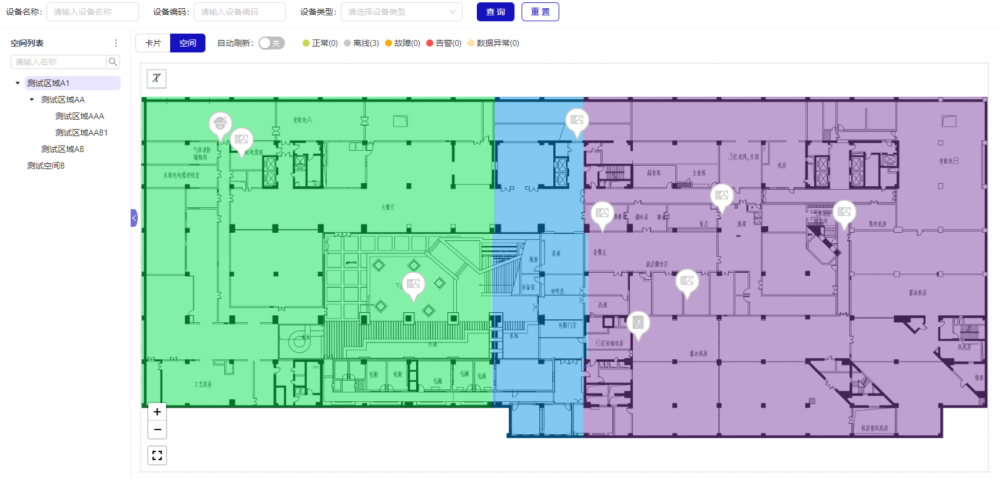
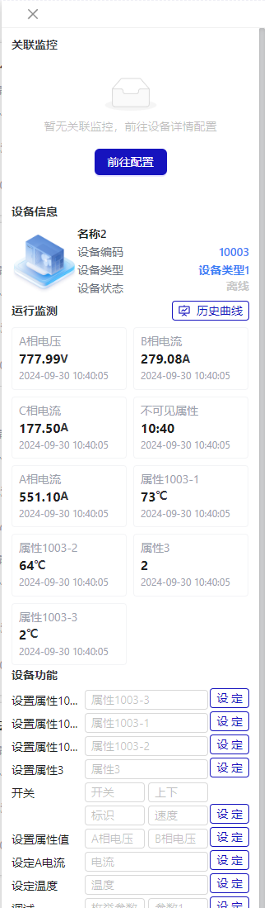

# 数据监控

## 概述

实时监控设备的各项关键指标，确保数据正常流转，对异常数据进行及时报警。支持卡片和空间 2 种模式查看。设备状态分为正常，离线，故障，告警，数据异常。侧边设备数据面板包含关联监控，设备信息，运行监测，设备功能 4 块内容。

- 列表模式

- 空间模式
  

- 侧边数据面板
  

### 列表模式

支持选择空间，展示该空间下绑定设备以卡片的方式展示设备的信息，包含设备基础信息，实时刷新展示最多 6 个该设备的属性数据，设备实时状态，属性最新刷新时间。绑定的设备数据支持设备名称，设备编码，设备类型的筛选。

### 空间模式

支持选择空间，展示该空间的地图信息及绑定设备的在地图上的定位图标信息。定位图标信息的不同颜色代表设备状态。绑定的设备数据支持设备名称，设备编码，设备类型的筛选。

### 侧边数据面板

侧边设备数据面板包含关联监控，设备信息，运行监测，设备功能 4 块内容。

- 关联监控
  展示设备关联的监控设备，如果有在这个模块进行展示

- 设备信息
  展示设备的基础信息，包括设备名称，设备编码，设备类型，设备状态等。点击设备编码和设备类型可以跳转到该设备的详情页面和所属设备类型详情页面。
  

- 运行监测
  展示设备的实时设备属性的值和刷新时间。历史曲线的功能可以直接跳转到设备详情页面的历史曲线查看各个属性的历史曲线。
- 设备功能
  展示该设备开放的功能并进行控制，比如开关，调控温度等。

### 设备状态

| 状态     | 描述                                           |
| -------- | ---------------------------------------------- |
| 正常     | 正常采集，保持 1 分钟心跳                      |
| 离线     | 3 分钟没有心跳信号，或者对应的采集器未正常工作 |
| 故障     | 设备故障字段绑定                               |
| 告警     | 设备告警字段或者从告警策略触发                 |
| 数据异常 | 采集数据不符合设备类型规定约束                 |

**排序：告警 > 故障 > 离线 > 数据异常 > 正常**
