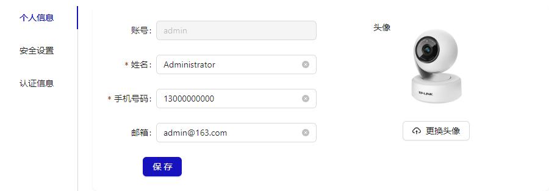
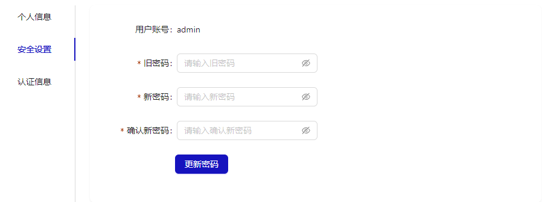
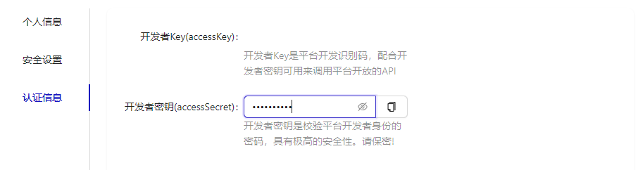

# 个人中心

## 概述

角色管理页面提供个人信息，安全设置，认证信息三个功能模块，用于当前用户维护在系统中的个人相关的信息。

- 个人信息
  

- 安全配置
  

- 认证信息
  

## 个人信息

便于用户维护自己的个人信息，包含姓名，手机号码，邮箱，头像。

## 安全配置

便于用户维护自己的安全信息，包含更改密码。

## 认证信息

认证信息用于平台开发时，对用户进行身份认证，结合开发者 key 和密钥可以调用平台开放的 API。请注意保密，否则造成滥用会冻结账户，影响使用。
