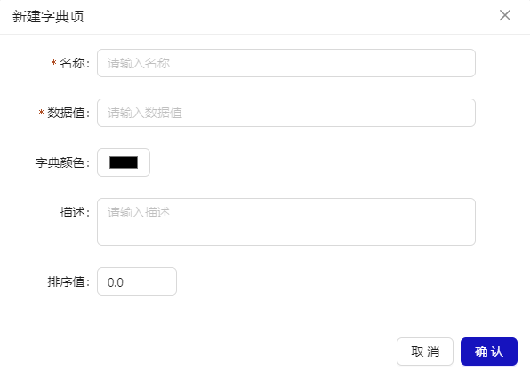

# 字典管理

## 概述

字典管理提供新增字典、字典数据筛选、字典项配置等功能。用于其他页面中可选择配置数据管理。不同的服务，通过 tab 页切换展示对应的数据字典。

## 新建字典

点击“新建”按钮，展示新建字典弹窗。系统一旦建设完，一般不建议自行修改或删除字典。

## 字典配置

点击列表数据行操作列“字典配置”，展示字典配置弹窗。

### 新建字典项

点击“新建”按钮，展示新建字典项弹窗。包含字典项名称、数据值、字典颜色，描述、排序值字段。

