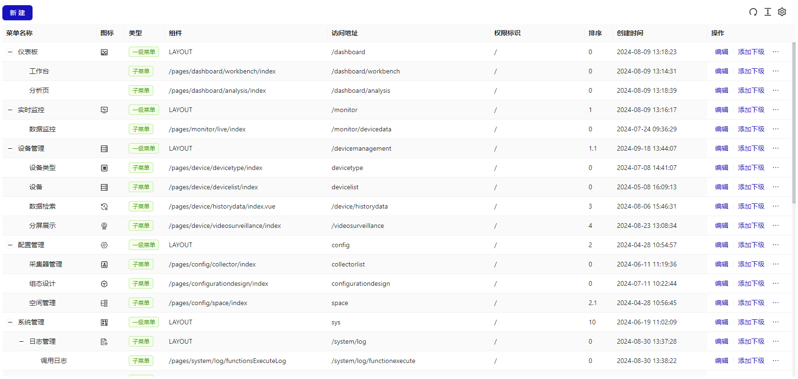
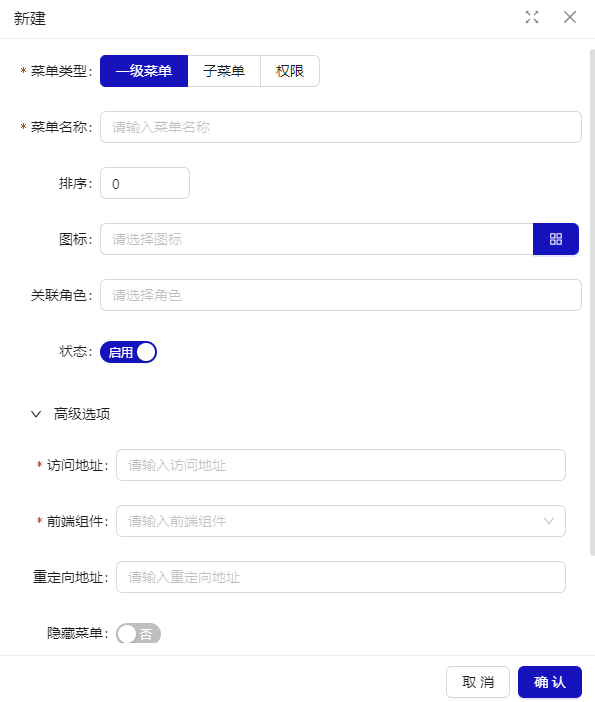
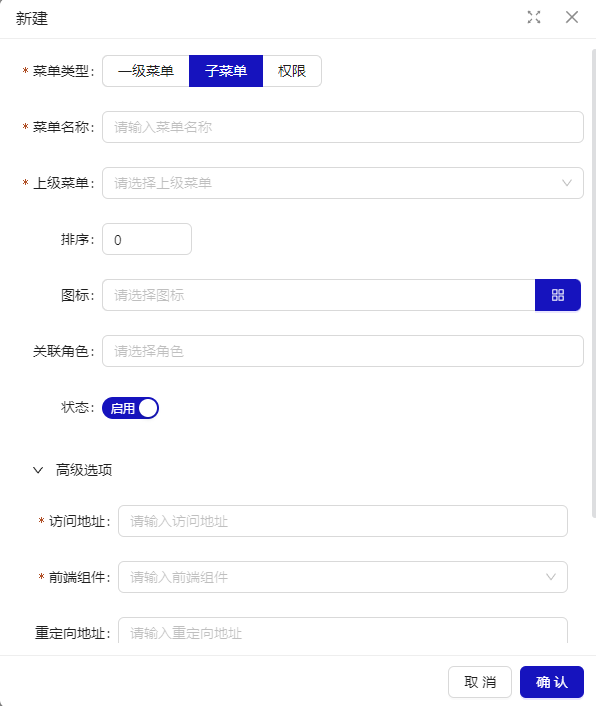
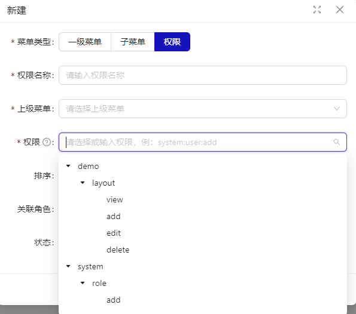

# 菜单管理

## 概述

菜单管理页面提供数据筛选、新增菜单、菜单配置三个功能模块，用于管理平台菜单。菜单类型包括一级菜单、子菜单、权限，以层级关系显示。


## 新建菜单

新建菜单，支持菜单类型为一级菜单，子菜单，权限这 3 种类型的菜单创建。

### 一级菜单

一级菜单主要用于菜单树中父级目录的创建。比如系统管理-菜单管理，系统管理这一级是一级菜单。包含“一般选项”的菜单类型、菜单名称、排序、菜单图标、关联角色、状态,“高级选项”的访问地址、前端组件、重定向地址、隐藏菜单、打开方式。


### 子菜单

子菜单主要用于菜单树中子级目录的创建。比如系统管理-菜单管理，菜单管理这一级是子级菜单。包含“一般选项”的菜单类型、菜单名称、上级菜单、排序、菜单图标、关联角色、状态,“高级选项”的访问地址、前端组件、重定向地址、隐藏菜单、打开方式。


### 权限

权限主要是用于配置对应菜单页面下的功能权限，比如查看、编辑、删除等。包含菜单类型、权限名称、上级菜单、权限、排序、关联角色、状态。

<div style="background-color: #ffebcd; padding: 10px; border-left: 4px solid #d19615;">
  功能权限配置需基于代码级支持。流程包括：规划权限项，前后端开发配置，最后通过勾选菜单权限完成设置。
</div>



| 配&nbsp;&nbsp;&nbsp;置&nbsp;&nbsp;&nbsp;项 | 描述                                                                                                                                      |
| ------------------------------------------ | ----------------------------------------------------------------------------------------------------------------------------------------- |
| 菜单类型                                   | 用于配置菜单类型，默认为一级菜单。                                                                                                        |
| 菜单名称                                   | 配置菜单名称。                                                                                                                            |
| 排序                                       | 用于配置菜单的排序，支持数字大小排序，默认为 0，展示时将按照升序排列。                                                                    |
| 菜单图标                                   | 用于配置菜单图标，默认为空。                                                                                                              |
| 关联角色                                   | 用于菜单与角色的关联，默认为空。                                                                                                          |
| 状态                                       | 分为启用和禁用，启用时菜单可正常访问，禁用时菜单不可访问。默认为启用。                                                                    |
| 访问地址                                   | 配置地址，比如配置/sys/menu，会显示在浏览器的地址栏中显示 http://localhost:8080/#/sys/menu。                                              |
| 前端组件                                   | 前端路由地址，/pages/system/menu/index，正常系统部署完，这个地址是固定的。 预设了组态页面、实时监测也页面、链接页面、布局页面、空白页面。 |
| 重定向地址                                 | 配置重定向地址，比如配置/a/b ，即浏览器地址栏中会显示 http://localhost:8080/#/a/b ，而不是前端组件时的路径地址。                          |
| 权限                                       | 功能权限指系统中的一系列操作，常见的如：删除，编辑，提交等。 一般不需要修改，系统开始时就已确定 。                                        |
| 隐藏菜单                                   | 用于配置菜单是否在菜单栏中隐藏，默认为否。                                                                                                |
| 打开方式                                   | 用于配置菜单打开方式，默认为“内部”在当前页打开。“外部”在新页面打开，一般适合 iframe 链接页面使用。                                        |

```
菜单数据与角色管理相结合，来管理平台的权限数据
```
