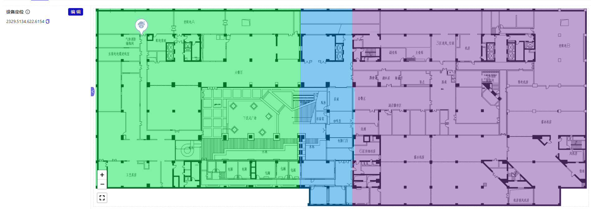

# 设备

## 概述

所有接入设备的展示页面，支持列表模式和空间模式。提供数据筛选、新建设备等操作。

- 列表模式

  

- 空间模式
  

- 设备详情页面
  

## 新建设备

新建方式支持单个或多个


## 批量操作

### 批量删除

### 批量导入，导出

## 列表模式


## 空间模式

支持设备在空间上查看，并支持未定位的设备在空间上打点定位，也可编辑空间内的设备定位。


```
设备定位操作的工具有如下功能
1. 显示/隐藏地图上设备点位的名称
2. 直接在地图上新建设备并打点定位
3. 框选操作，支持批量移动和移除框选范围内的设备
4. 清除地图上所有设备点位
5. 还原到上次保存的地图状态和设备定位数据
6. 缩放
7. 全屏
```

## 设备详情

设备详情页面包含设备的所有信息，包括设备基础信息，运行数据，设备位置，关联监控，采集配置，设备功能，日志管理这几块功能。

### 设备基础信息

显示设备基础信息，包括设备名称，设备类型，设备编码，所属空间，图标，设备定位状态，设备二维码等。


### 运行数据

显示设备运行数据，分为实时数据和历史曲线。实时数据展示当前设备的所有属性指标数据，也可查看单个设备属性指标的历史数值数据；历史曲线展示设备属性指标的历史曲线数据，支持近 1 小时，近 3 小时，近 12 小时，近 24 小时，近 7 天，近 30 天，周期，方法筛选。


### 设备位置

显示设备在空间中的位置，支持设备定位，支持设备在空间上打点定位，也可编辑空间内的设备定位。


### 关联监控（待完成）

支持关联监控，支持关联监控的编辑，删除，新建关联监控。

### 采集配置

设备绑定采集器，支持多个绑定。通过采集器配置所需字段与该设备所属的设备类型配置的参数结合来配置绑定采集器。通过绑定采集器，可以将采集器采集的数据直接关联到具体的设备上，便于数据的归类和分析；可以实时监控设备的状态和运行情况，及时发现故障；也可远程控制设备，调整设备参数或执行特定操作。

| 配置项 | 描述 |
| -------- | ---------------------------------------------- |
| 设备配置 | 用于配置采集器连接等相关的参数 |
| 属性配置 | 用于配置采集器中与属性相关的参数 |
| 功能配置 | 用于配置采集器中与功能相关的参数 |
| 事件配置 | 用于配置采集器中与事件相关的参数 |

### 功能设备

展示该设备开放的功能并进行控制，比如开关，调控温度等。


### 日志管理

展示该设备有关的所有日志，如调用日志，维修日志，巡检日志，保养日志，支持日志的查看，下载，删除等操作。现阶段做了调用日志

| 名称 | 描述 |
| -------- | ---------------------------------------------- |
| 调用日志 | 记录设备的功能被调用的时间、具体操作、下发类型，执行情况等信息 |
| 维修日志 | 记录设备的维修记录，包括维修时间、维修人员、维修内容和结果。 |
| 巡检日志 | 记录定期巡检的情况，包括巡检时间、巡检人员、巡检内容和发现的问题。 |
| 保养日志 | 记录设备的保养记录，包括保养时间、保养人员、保养内容和结果。 |
