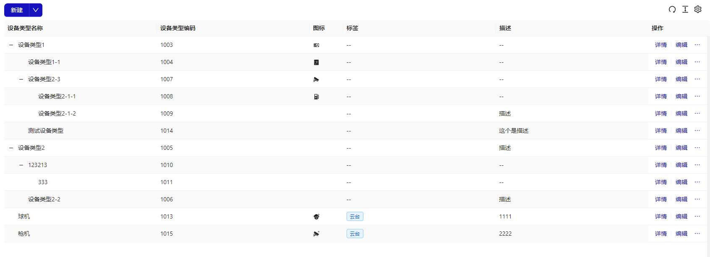
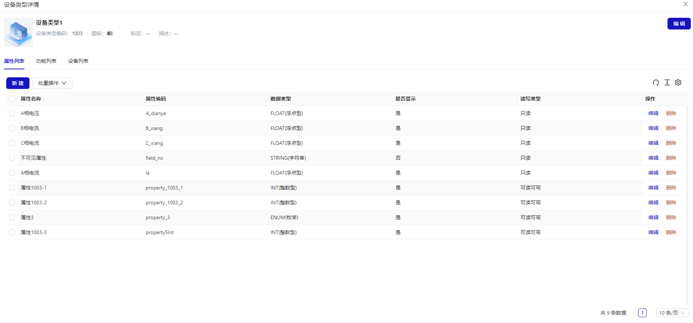

# 设备类型

## 概述

设备类型是设备的集合，通常是对同类型、同型号物理设备的描述。设备类型包含属性列表，功能列表，设备列表等主要功能

- 列表
  

- 详情
  

## 新建设备类型

### 空间模式

大部分团队都使用`git`作为版本库，管理好代码也是一种学问。尤其是涉及多人并发协作、需要管理多个软件版本的情况下，定义良好的版本库管理规范，可以让大型项目更有组织性，也可以提高成员协作效率。

比较流行的`git`分支模型/工作流是[git-flow](https://www.git-tower.com/learn/git/ebook/cn/command-line/advanced-topics/git-flow)，但是大部分团队会根据自己的情况制定自己的 git 工作流规范。目前公司前端研发`git`分支模型如下：

```
├── release
├── master
├── dev
├── member1
└── member2
```

#### 侧边数据面板
