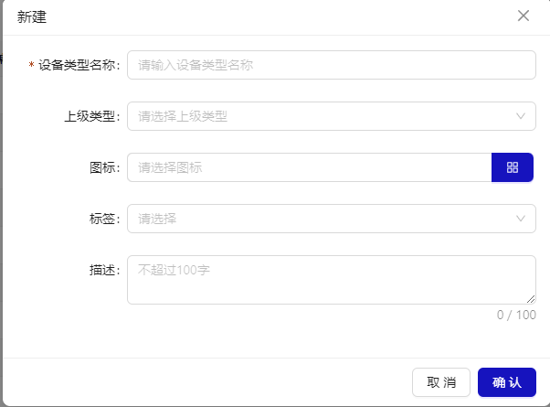
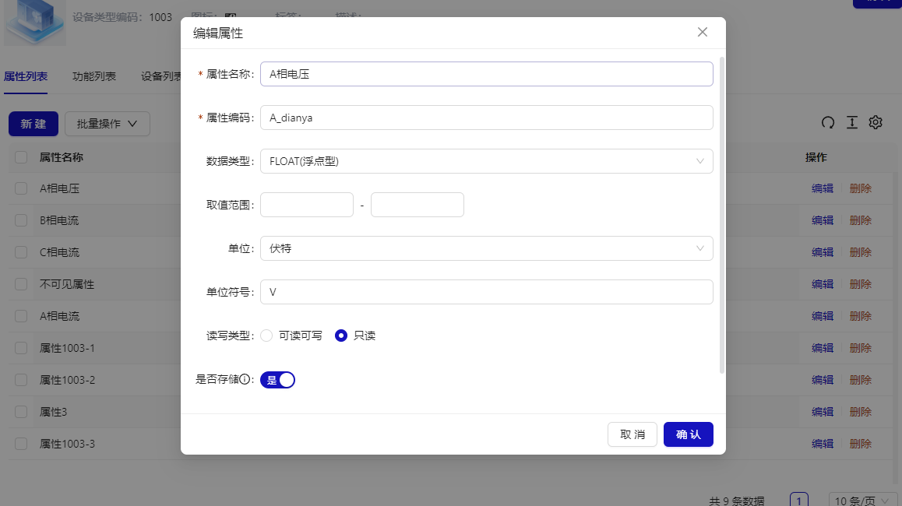
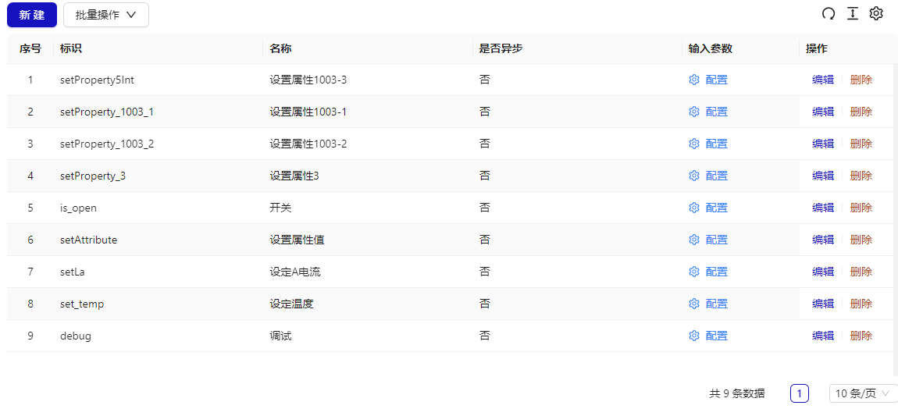
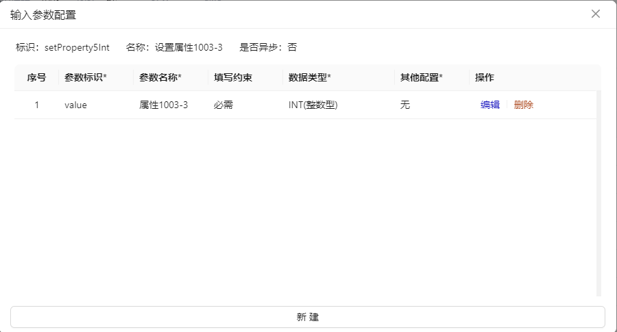
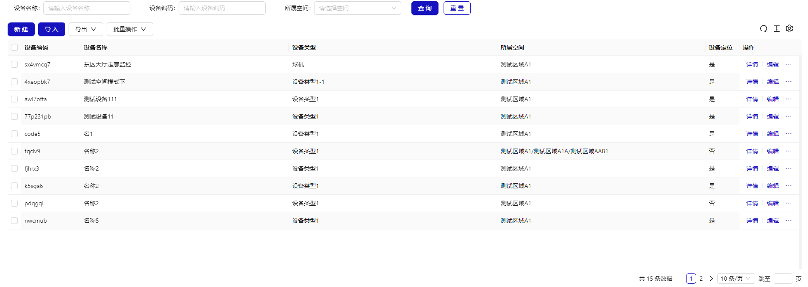

# 设备类型

## 概述

设备类型是设备的集合，通常是对同类型、同型号物理设备的描述。设备类型包含属性列表，功能列表，设备列表等主要功能

- 列表
  

- 详情
  

## 新建设备类型

## 设备类型详情

展示设备类型详情，包括设备类型的基础信息，属性列表，功能列表，设备列表等主要功能

### 基础信息

基础信息包含了设备类型名称，编码，大图标，小图标，标签，描述等。可以编辑。

**标签用于一些特殊需求，如预设了“云台”，一旦标记了云台，功能列表中字段会自动多出云台相关的字段，如上下左右，缩放等用于云台控制。**

### 属性列表

定义属于该设备类型集合的设备会有的属性，属性字段包含属性名称，属性编码，数据类型，取值范围，是否显示，读写类型，单位，单位符号，是否存储等内容。

### 功能列表

定义属于该设备类型集合的设备会有的功能，功能字段包含标识，功能名称，是否异步，输入参数等内容。“输入参数”支持多参数配置，方便扩展。

### 设备列表

显示属于该设备类型的设备列表，可以查看设备详情，支持批量删除。

