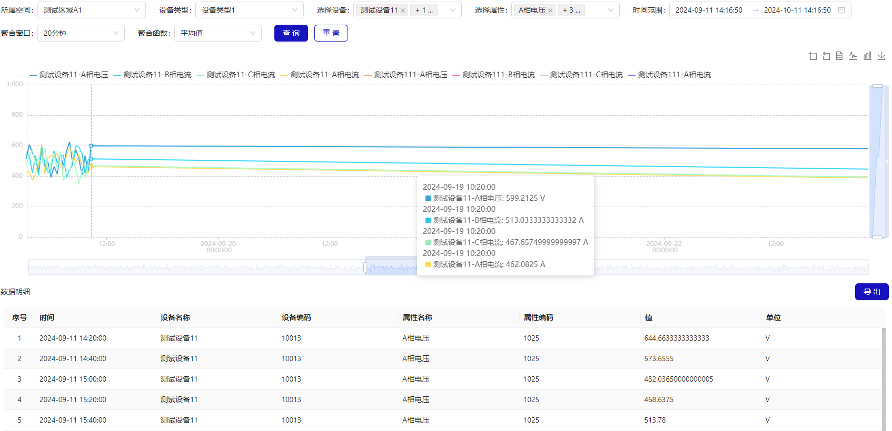

# 数据检索

## 概述

设备采集后的历史数据检索功能支持多维度查询和聚合窗口分析，提供丰富的聚合函数，并展示曲线图及数据明细表，支持导出功能。

1. **多维度查询**：

   - **灵活筛选**：支持按时间范围、设备类型、设备编号，属性值等多个维度进行筛选。
   - **组合查询**：可以组合多个条件进行复杂查询，满足不同场景的需求。

2. **聚合窗口分析**：

   - **聚合窗口**：支持按原始值、5 分钟、20 分钟、1 小时、4 小时、24 小时等时间窗口进行聚合分析。
   - **聚合函数**：提供多种聚合函数，如平均值（AVG）、最大值（MAX）、最小值（MIN）、首位值（FIRST）、末位值（LAST）等。

3. **曲线图展示**：

   - **动态图表**：展示聚合后的数据曲线图，直观反映数据趋势。
   - **交互式图表**：支持缩放、拖动等功能，便于查看细节。

4. **数据明细表**：

   - **详细记录**：展示原始数据的明细表，包括时间戳、设备编号、采集值等信息。
   - **排序与过滤**：支持对明细表进行排序和过滤，便于查找特定数据。

5. **导出功能**：
   - **多种格式**：支持将查询结果导出为 CSV、Excel 等常见格式。
   - **批量导出**：可以一次性导出大量数据，方便后续分析和存档。

