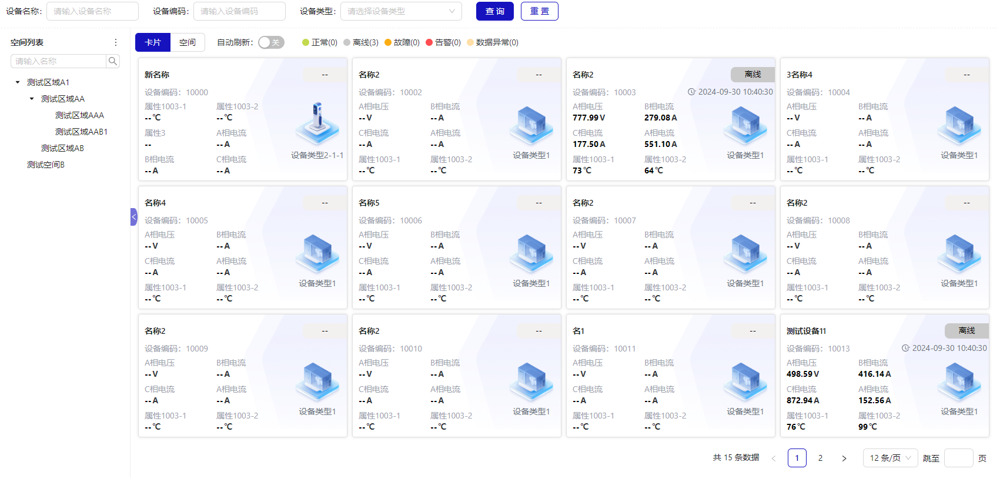
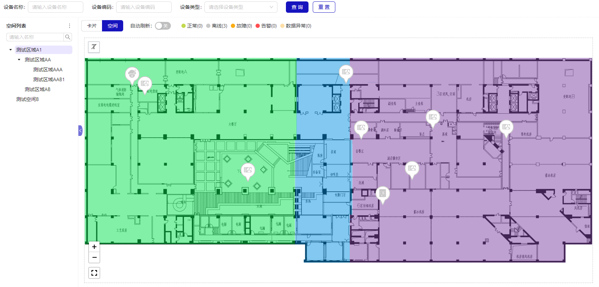
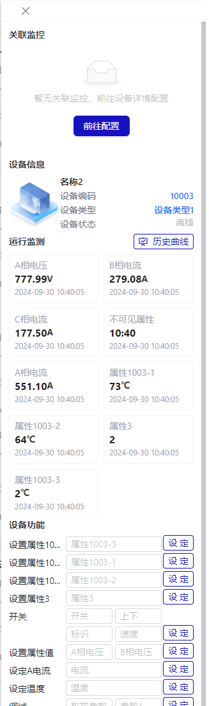

# 数据检索

## 数据监控

实时监控设备的各项关键指标，确保数据正常流转，对异常数据进行及时报警。侧边设备数据面板包含关联监控，设备信息，运行监测，设备功能 4 块内容。

- 列表模式



- 空间模式
  

- 侧边数据面板
  

### 列表模式

### 空间模式

大部分团队都使用`git`作为版本库，管理好代码也是一种学问。尤其是涉及多人并发协作、需要管理多个软件版本的情况下，定义良好的版本库管理规范，可以让大型项目更有组织性，也可以提高成员协作效率。

比较流行的`git`分支模型/工作流是[git-flow](https://www.git-tower.com/learn/git/ebook/cn/command-line/advanced-topics/git-flow)，但是大部分团队会根据自己的情况制定自己的 git 工作流规范。目前公司前端研发`git`分支模型如下：

```
├── release
├── master
├── dev
├── member1
└── member2
```

#### 侧边数据面板
