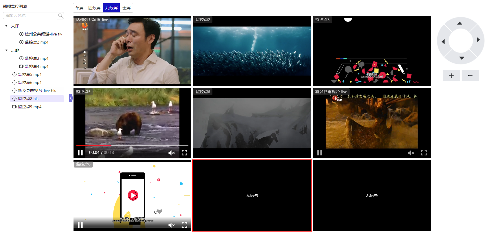

# 分屏展示

## 概述

视频监控系统支持多种分屏展示模式，包括单屏、四分屏、九分屏和全屏模式，并且支持云台操作，提供全面的监控管理功能。

1. **分屏展示模式**：

   - **单屏模式**：显示单个摄像头的画面，适合集中关注某个特定区域。
   - **四分屏模式**：将屏幕分为四个部分，每个部分显示一个摄像头的画面，适合同时监控多个关键位置。
   - **九分屏模式**：将屏幕分为九个部分，每个部分显示一个摄像头的画面，适合大规模监控场景。
   - **全屏模式**：全屏显示当前显示的画面，提供更大的视觉效果，适合详细观察。

2. **云台操作**：

   - **方向控制**：支持上下左右方向控制，可以自由调整云台的方向。
   - **变焦控制**：支持变焦操作，可以放大或缩小画面，以便更清晰地查看细节。
   - **预置位设置**：支持预置位设置，可以保存常用的位置，一键切换到预设位置。

3. **交互式操作**：
   - **鼠标操作**：支持鼠标点击和拖动操作，方便快捷地调整分屏模式和云台位置。

