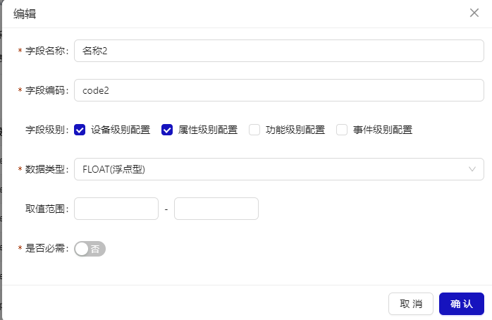

# 采集器管理

## 概述

采集器列表页面，可新建采集器、编辑采集器、删除采集器。新建采集器可以从模板导入，方便快速搭建采集器。采集器列表包含采集器名称，采集器编码，刷新配置间隔(秒)，采集模式（变化上报/周期上报）,全量/周期上报间隔(秒)，运行状态，采集状态等信息。

- 列表
  

- 采集器详情
  

## 采集器详情

采集器详情，包含采集器基本信息，配置信息，字段定义，设备列表等主要模块。

### 基本信息

采集器基本信息，包含采集器名称，采集器编码，开发授权码，刷新配置间隔，采集模式，上报间隔，描述，状态，运行状态，采集状态，最近在线时间，创建时间。

### 配置信息

键值对，是采集器所需的配置字段

### 字段定义

配置采集器所支持的用于设备采集的数据的字段。

### 设备列表

采集器所关联的设备列表，支持解绑设备。

