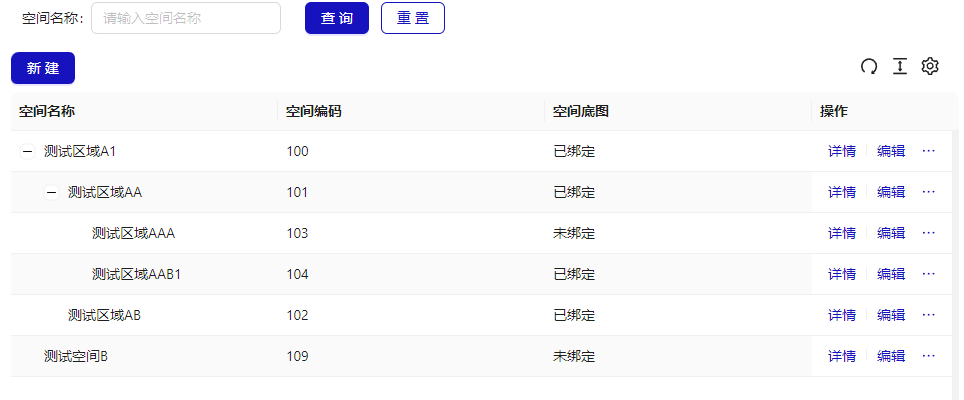
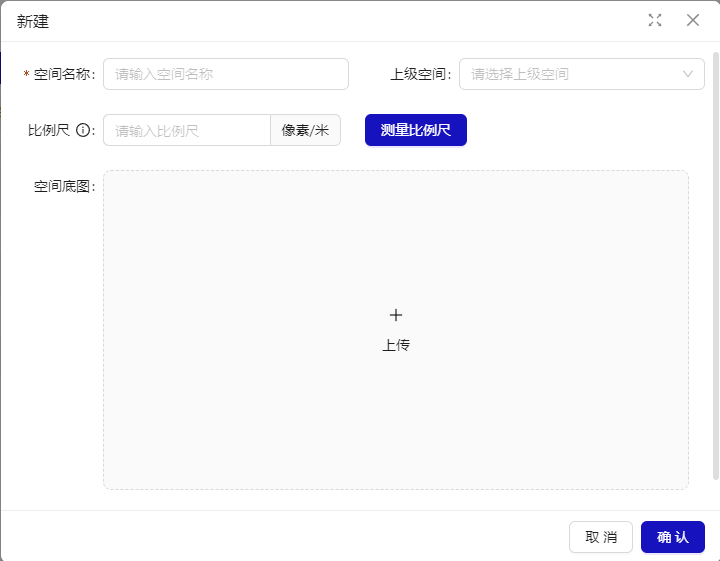
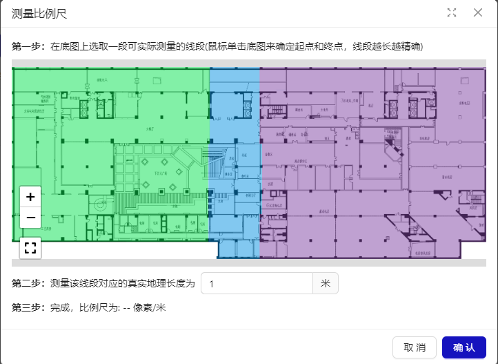
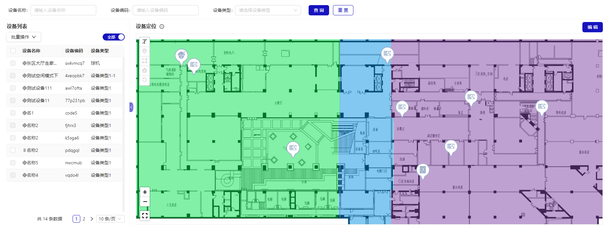
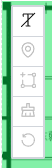
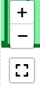

# 空间管理

## 概述

空间列表，采用树形层级来管理展示空间，便于管理和导航。可以将空间划分为不同的区域，如楼层、部门、房间等。每个空间节点都可以包含子节点，形成清晰的层次结构。

## 新建空间

支持空间名称，层级关系，比例尺及空间底图编辑。

## 空间详情

空间详情，包含空间基础信息，底图信息。

### 基础信息

包含空间名称，空间编码，层级关系，比例尺等

### 底图信息

底图信息，包含空间底图信息，支持设备在该空间中进行打点管理。界面分为左侧设备列表，右侧地图展示。

**左侧设备列表交互**

- 展示该空间下绑定的设备，列表有设备名称，设备编码，设备类型，定位与否的图标。如果设备已定位，则无法进行拖动到右侧底图中打点。
   
  **右侧底图信息交互**
  点击“编辑”按钮或者左侧未打点设备移入到底图这 2 种情况下，底图进入编辑状态，该状态下工具栏中新建，框选，移除全部，还原可以操作，否则不可操作。

- **显示/隐藏名称**：默认不显示设备名称，图标为不显示名称的图标，点击显示设备名称在图标上，图标改为显示名称图标。

- **新建**：点击【新建】工具栏，新建工具栏聚焦。聚焦后鼠标变成+和显示一个默认定位的图标，可在地图选择合适的位置，再次点击鼠标左键后弹窗来新建设备，新建成功后在点击处打上点。可以继续移动位置继续进行点击弹窗添加设备。再次点击或者切换其他工具栏后，取消掉新建的交互操作

- **框选**：击【框选】工具栏，框选工具栏聚焦，可以显示二级菜单项，比如取消，移除框选内容。取消即取消框选框，移除框选内容即移除框选框即框选的图标。聚焦后鼠标左键点击即开始框选，移动鼠标就绘制矩形，再次点击鼠标左键即结束绘制，绘制的矩形根据开始鼠标与结束鼠标的坐标点决定。可以左键按住移动绘制的框选框，内部的图标也一起移动，再次点击或者切换其他工具栏后，取消掉框选的交互操作

- **移除全部**：图标需要标红显示，并二次提醒确认后才能移除底图上所有图标。

- **还原**：重置底图上一次保存的图标数据 ，需要二次确认下。

- **全屏/非全屏**：默认非全屏，显示非全屏图标，点击全屏后，将地图部分全屏，并包含工具栏，图标变成非全屏图标，再点击或者浏览器退出全屏后，地图还原，图标变成全屏图标。

- **放大**：地图按比例放大，最大放大到 4 倍，超过后不可点击，图标置为不可操作 放大也可通过鼠标滚轮“上滑” 。

- **缩小**：地图按比例缩小，最小到 20%，超过后不可点击，图标置为不可操作 缩小也可通过鼠标滚轮“下滑” 。
