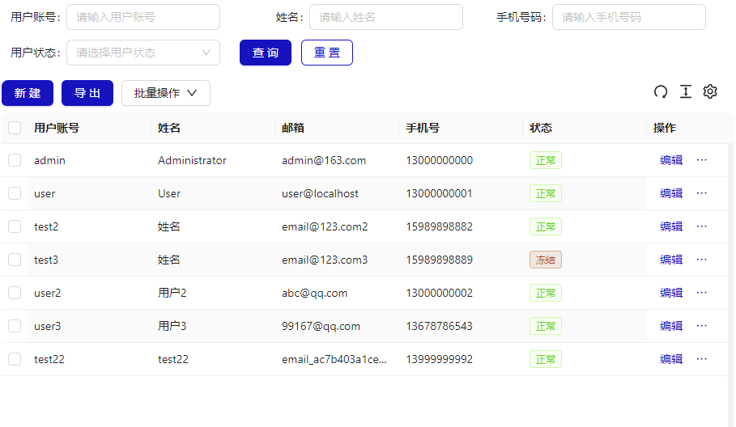
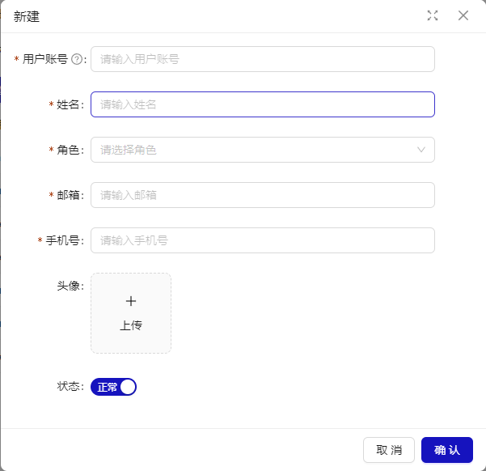

# 用户管理

## 概述

用户管理页面提供数据筛选、新增用户、用户数据列表三个功能模块。

## 新建用户

点击“新建” 按钮，弹出用户信息填写窗口。

| 配置项 | 描述 |
| -------- | ---------------------------------------------- |
| 状态 | 分为正常，冻结。“冻结”状态下用户将无法登录系统。管理员可解冻 |

## 用户数据列表

默认按用户创建时间倒序排列，每页 10 条数据。
