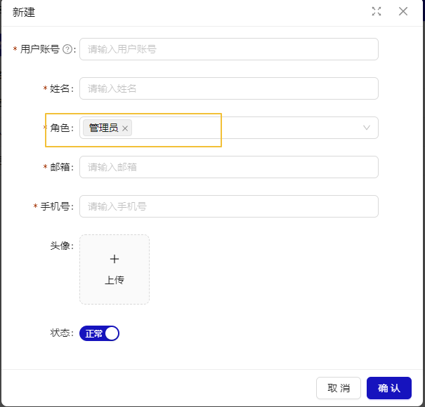

# 角色管理

## 概述

角色管理页面提供数据筛选、新增角色、数据列表三个功能模块，用于管理平台角色。

**角色类型 分为内置和自定义，“内置”不可删除。“自定义”可以删除。**

## 新建角色

点击“新建”，展示新建角色弹窗。

## 关联用户

点击列表数据行操作列“用户”，展示关联用户弹窗。

### 新建用户

可以新建用户，关联当前角色。

### 已有用户

可以关联已有用户。

## 授权

点击列表数据行操作列“授权”，展示角色权限配置弹窗。可配置角色的访问的页面数据及对应的按钮级别的权限。

