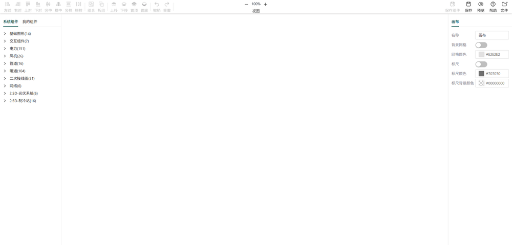

# 画布编辑

组态编辑器主要由顶部工具栏、左侧工具栏、中间画布区域和右侧属性面板组成，本文将详细介绍各功能区域的使用方法。

## 主界面布局

### 1. 顶部工具栏

顶部工具栏包含了编辑器的核心操作功能，主要分为以下几个部分：

#### 对齐和分布

- **左对**：将选中元素左对齐
- **右对**：将选中元素右对齐
- **上对**：将选中元素上对齐
- **下对**：将选中元素下对齐
- **竖中**：将选中元素垂直居中对齐
- **横中**：将选中元素水平居中对齐
- **竖排**：将选中元素沿垂直方向均匀分布
- **横排**：将选中元素沿水平方向均匀分布

#### 组合操作

- **组合**：将多个选中元素组合成一个组
- **拆组**：将组合元素拆分为单个元素

#### 层级操作

- **上移**：将选中元素上移一层
- **下移**：将选中元素下移一层
- **置顶**：将选中元素置顶
- **置底**：将选中元素置底

#### 历史记录

- **撤销**：撤销上一步操作
- **重做**：重新执行上一步被撤销的操作

#### 视图操作

- **缩小**：减小画布缩放比例
- **放大**：增加画布缩放比例
- **自适应大小**：调整画布缩放比例，使所有元素适应窗口

#### 文件操作

- **保存组件**：保存组合内容
- **保存**：保存当前画布内容
- **预览**：在新窗口中预览画布效果
- **帮助**：打开帮助文档
- **文件**：更多文件相关操作（详情请查看[文件操作](#文件操作)章节）

### 2. 左侧工具栏

左侧工具栏主要包含资产面板，用于管理和选择要添加到画布的元素：

#### 系统组件

- **基础图形**：包含常用的矩形、圆形、三角形等基本图形
- **交互组件**：包含流动条、线段、变量值、旋转图片、浮子器、切换图片等
- **各种行业图标**：包含电力、交通、物流、医疗、金融等行业相关图标

#### 我的组件

- **用户自定义组件**：用户保存的自定义组合图形

### 3. 中间画布区域

画布区域是编辑的主要工作区，用于创建和编辑组态画面：

- **拖拽添加**：从左侧工具栏拖拽元素到画布
- **选择元素**：点击或框选元素进行选择
- **移动元素**：拖拽选中的元素到目标位置
- **缩放元素**：拖拽元素的控制点进行缩放
- **旋转元素**：拖拽元素的旋转控制点进行旋转
- **右键菜单**：右键点击元素或画布，打开上下文菜单

### 4. 右侧属性面板

右侧属性面板用于配置选中元素的属性：

#### 画布属性

- **画布名称**：设置画布的名称，用于标识不同的组态画面
- **背景网格**：设置画布的背景网格，用于辅助布局和对齐元素
- **标尺**：显示画布的标尺，用于辅助布局和对齐元素

#### 数据

- **前置条件**：执行后续操作数据联动的前置条件，部分交互组件独有，如流动条
- **数据源**：数据属性，用于关联设备的属性，支持单个和变量与公式配置 2 种方式
  - **单个**：直接关联设备的属性，如`设备1.属性1`
  - **变量与公式**：关联复杂的计算表达式，如`(设备1.属性1 + 变量1) * 2`
- **功能**：数据属性的功能，如文本颜色，旋转动画，切换图片等，根据不同交互组件，功能不同
- **事件配置**：添加元素的交互事件，如单击、双击等
- **动效配置**：添加元素的动画效果，如闪烁、隐藏等

#### 样式

- **基本属性**：位置、大小、旋转角度等
- **样式属性**：填充颜色、边框样式等

## 基本操作

### 添加元素

1. 从左侧工具栏选择要添加的元素
2. 拖拽到画布的目标位置
3. 松开鼠标，元素将被添加到画布

### 选择元素

- **单个选择**：点击要选择的元素
- **多个选择**：按住 Shift 键，依次点击要选择的元素，或拖动鼠标框选多个元素
- **取消选择**：点击画布空白区域

### 编辑元素

1. 选中要编辑的元素
2. 在右侧属性面板中修改元素属性
3. 或直接在画布上拖拽、缩放、旋转元素

### 删除元素

1. 选中要删除的元素
2. 按 Delete 键，或
3. 右键点击元素，选择删除选项

### 移动元素

1. 选中要移动的元素
2. 拖拽元素到目标位置
3. 松开鼠标，元素将被移动到新位置

### 缩放元素

1. 选中要缩放的元素
2. 拖拽元素四周的控制点进行缩放
3. 按住 Shift 键可保持元素比例缩放

### 旋转元素

1. 选中要旋转的元素
2. 拖拽元素上方的旋转控制点进行旋转
3. 按住 Shift 键可按 15 度增量旋转

### 组合与解组

- **组合**：选中多个元素，点击顶部工具栏的"组合"按钮
- **解组**：选中组合元素，点击顶部工具栏的"拆组"按钮

## 快捷键

| 快捷键               | 功能             |
| -------------------- | ---------------- |
| Ctrl + C             | 复制选中元素     |
| Ctrl + V             | 粘贴元素         |
| Ctrl + Z             | 撤销操作         |
| Ctrl + Y             | 重做操作         |
| Delete               | 删除选中元素     |
| Ctrl + A             | 全选画布元素     |
| Shift + 鼠标左键点击 | 多选元素         |
| Ctrl + G             | 组合选中元素     |
| Ctrl + Shift + G     | 解组选中元素     |
| {                    | 上移一层选中元素 |
| }                    | 下移一层选中元素 |
| [                    | 置顶选中元素     |
| ]                    | 置底选中元素     |
| 滚轮                 | 缩放画布         |
| space + 鼠标左键     | 移动画布         |
| 键盘 →               | 移动选中元素向右 |
| 键盘 ←               | 移动选中元素向左 |
| 键盘 ↑               | 移动选中元素向上 |
| 键盘 ↓               | 移动选中元素向下 |

## 画布操作技巧

1. **缩放画布**：使用鼠标滚轮缩放画布，或点击顶部工具栏的缩放按钮
2. **平移画布**：按住鼠标右键拖拽画布，或使用鼠标中键拖拽
3. **对齐辅助线**：当移动元素靠近其他元素时，会显示对齐辅助线，帮助精确对齐
4. **网格吸附**：可开启网格吸附功能，使元素自动吸附到网格线
5. **批量操作**：选中多个元素，可同时修改它们的属性

## 文件操作

### 保存为组件

将当前选中的组保存为自定义组件，方便后续重复使用：

1. 组合多个元素
2. 选中组合元素
3. 点击顶部工具栏的"保存组件"按钮
4. 输入组件名称，点击确定
5. 组件将保存到【我的组件】库中，可在左侧资源栏中找到

### 保存画布

将当前画布内容保存到平台：

1. 点击顶部工具栏的"保存"按钮
2. 默认使用右侧画布属性中设置的画布名称

### 预览效果

在新窗口中预览画布效果，查看最终的交互和动画效果：

1. 点击顶部工具栏的"预览"按钮

### 查看帮助

打开帮助文档获取使用指导：

1. 点击顶部工具栏的"帮助"按钮

### 文件菜单操作

通过顶部工具栏的"文件"下拉菜单，可执行以下操作：

#### 新建文件

1. 鼠标移动到顶部工具栏的"文件"按钮上
2. 点击"新建文件"选项
3. 当前画布内容将被清空，可开始创建新画布

#### 打开文件

1. 鼠标移动到顶部工具栏的"文件"按钮上
2. 点击"打开文件"选项
3. 在打开的文件列表中选择要打开的画布文件
4. 点击"导入"按钮
5. 画布会清空，并加载选中文件的内容

#### 导入文件

1. 鼠标移动到顶部工具栏的"文件"按钮上
2. 点击"导入文件"选项
3. 在文件选择对话框中选择要导入的 JSON 文件
4. 点击"打开"按钮
5. 画布会清空，并加载选中文件的内容

#### 另存为

1. 鼠标移动到顶部工具栏的"文件"按钮上
2. 点击"另存为"选项
3. 在保存对话框中输入新的文件名
4. 点击"保存"按钮，画布将以新名称保存到系统

#### 下载 JSON 文件

1. 鼠标移动到顶部工具栏的"文件"按钮上
2. 点击"下载 JSON 文件"选项
3. 当前画布的 JSON 文件将被下载到本地
4. 可将下载的 JSON 文件分享给他人，或在其他平台上导入使用
