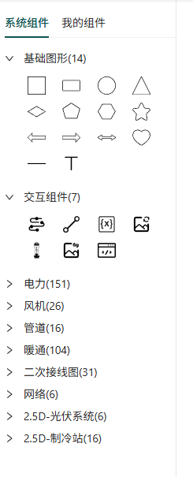
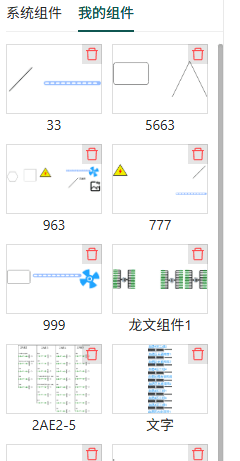

# 组件介绍

组件是组态编辑器中的基本构成元素，通过组合和配置不同的组件，可以创建出丰富多样的组态画面。组态编辑器包含两类主要组件：系统组件和我的组件。

## 1. 组件分类

### 1.1 系统组件

系统组件是组态编辑器内置的预设组件，按照功能和特性可以分为以下几类：

#### 基础图形组件

基础图形组件是构成组态画面的基本元素，包括：

- **基本形状**：矩形、圆形、三角形、多边形、静态文本等

基础图形组件主要用于构建组态画面的基本布局和静态展示内容。

#### 交互组件

交互组件是具有数据交互和动态效果的组件，是组态画面中实现动态效果和数据展示的核心组件。交互组件与配置的设备数据绑定，实现数据联动效果。

主要的交互组件包括：

| 组件名称   | 功能描述                         | 应用场景                     |
| ---------- | -------------------------------- | ---------------------------- |
| 流动条     | 展示流体流动效果，可绑定流速数据 | 管道、液体传输系统           |
| 线段       | 可配置样式和动画的线条           | 连接线、状态指示线           |
| 变量值     | 实时显示设备数据，支持格式配置   | 数据监控、数值展示           |
| 旋转图片   | 根据数据旋转的图片               | 电机、风扇等旋转设备         |
| 浮子计量器 | 模拟液位、料位等计量效果         | 储罐、计量设备               |
| 切换图片   | 根据数据切换显示不同图片         | 状态指示、设备开关           |
| 网页       | 嵌入外部网页内容                 | 集成第三方系统、展示网页内容 |

交互组件需要进行数据配置才能发挥其功能，主要包括数据源配置、事件配置和效果配置。

#### 其他行业图库

### 1.2 我的组件

我的组件相当于自定义模板，可以重复使用，提高组态编辑效率。

我的组件是用户自定义的组合组件，通过以下方式创建：

1. 在画布中选择一个或多个组件
2. 点击顶部工具栏的"保存组件"按钮
3. 输入组件名称，点击确定
4. 组件将保存到"我的组件"面板中，显示截图和名称

## 2. 组件基本操作

### 2.1 添加组件

从左侧组件面板选择需要的组件，拖拽到画布的目标位置即可添加组件。

### 2.2 选择组件

- **单选**：点击画布中的组件进行选择
- **多选**：按住 Ctrl 键，依次点击多个组件；或拖拽鼠标框选多个组件
- **取消选择**：点击画布空白区域

### 2.3 编辑组件

选择组件后，可以通过以下方式编辑组件：

- **拖拽调整位置**：拖拽组件到新的位置
- **缩放调整大小**：拖拽组件四周的控制点进行缩放
- **旋转组件**：拖拽组件上方的旋转控制点进行旋转
- **属性面板配置**：在右侧属性面板中修改组件属性

### 2.4 删除组件

选择组件后，按 Delete 键或右键菜单选择"删除"选项删除组件。

## 4. 我的组件使用方法

### 4.1 创建我的组件

1. 在画布中选择一个组合组件
2. 点击顶部工具栏的"保存组件"按钮
3. 输入组件名称和描述
4. 点击确定，组件将保存到"我的组件"面板

### 4.2 使用我的组件

1. 在左侧组件面板中切换到"我的组件"标签
2. 选择需要使用的组件，拖拽到画布中
3. 根据需要调整组件位置和大小
4. 配置组件的数据绑定和事件

### 4.3 管理我的组件

- **删除组件**：列表中，点击组件右上角的删除按钮，删除组件

## 5. 组件最佳实践

### 5.1 组件选择原则

- 根据功能需求选择合适的组件类型
- 优先使用系统组件，必要时创建自定义组件
- 考虑组件性能，避免过多使用复杂交互组件
- 保持组件风格一致，统一配色和样式

### 5.2 组件布局建议

- 使用网格对齐，保持组件排列整齐
- 合理使用容器组件，组织相关组件
- 重要信息放在显眼位置
- 避免组件重叠，影响交互效果

### 5.3 数据绑定建议

- 合理设置数据更新频率，避免频繁更新影响性能
- 为关键数据添加告警机制
- 使用合适的数据可视化组件展示不同类型数据
- 考虑数据异常情况的处理

## 6. 常见问题

### 6.1 组件拖入画布后不显示

- 检查组件是否被其他组件遮挡
- 检查组件的尺寸和位置是否在可视范围内
- 刷新页面，重新尝试添加组件

### 6.2 组件数据不更新怎么办？

- 检查数据源配置是否正确
- 检查设备是否在线，数据是否正常
- 检查数据更新频率设置
- 检查浏览器控制台是否有错误信息

### 6.3 我的组件无法保存

- 确保选择了至少一个组件
- 检查组件是否包含非法字符
- 刷新页面，重新尝试保存

### 6.4 组件性能不佳

- 减少组件数量，避免过度使用复杂组件
- 降低数据更新频率
- 关闭不必要的动画效果
- 优化组件层次结构，减少嵌套层级

通过合理使用和配置组件，可以创建出功能丰富、性能优良的组态画面。组件是组态编辑器的核心元素，掌握组件的使用方法是进行组态编辑的基础。
