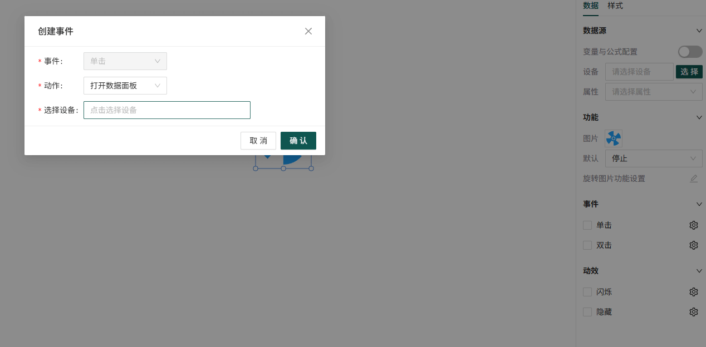

# 数据配置

数据配置是组态编辑器中的核心功能之一，通过将设备数据与画布元素关联，可以创建出动态、交互的组态画面。本文将详细介绍数据配置的各个方面，包括前置条件、数据源配置、功能配置、事件配置和动效配置等。

## 1. 前置条件

前置条件配置允许您为组件添加条件判断逻辑，只有当满足特定条件时，组件才会执行相应的功能或显示特定的效果。
**ps:流动条组件独有**

### 1.1 配置入口

1. 选择需要配置前置条件的画布元素
2. 在右侧属性面板中找到"前置条件"配置项
3. 开启"前置条件配置"开关
4. 点击设置图标打开前置条件配置弹窗

### 1.2 配置界面

前置条件配置弹窗包含以下主要元素：

- **变量配置**：添加和管理用于条件判断的变量
- **公式配置**：编写条件判断公式
- **测试变量值**：测试公式的计算结果
- **操作符**：提供各种比较和逻辑操作符

### 1.3 配置步骤

1. 点击"添加变量"按钮，选择设备和属性
2. 在公式输入框中编写条件判断公式，如：`[4g空调测试开关]>2`
3. 在"测试变量值"输入框中输入测试值，验证公式结果，结果需要为布尔值
4. 点击"确认"按钮保存配置

### 1.4 支持的操作符

- **比较操作符**：大于(>)、大于等于(>=)、小于(<)、小于等于(<=)、等于(===)、不等于(!==)
- **逻辑操作符**：逻辑与(&&)、逻辑或(||)
- **一般操作**：括号()

### 1.5 使用场景

- 仅当设备温度超过阈值时显示警告
- 仅当设备处于运行状态时显示控制按钮
- 仅当多个条件同时满足时触发动作

## 2. 数据源配置

数据源配置允许您为图形绑定数据，可以选择单个设备的属性，也可以通过变量与公式配置进行数据计算。

### 2.1 单个设备属性配置

#### 2.1.1 配置步骤

1. 选择需要配置数据源的画布元素
2. 在右侧属性面板中找到"数据源"配置项
3. 开启"数据源"开关
4. 点击"选择"按钮，打开设备选择模态框
5. 在模态框中可以通过搜索、筛选等方式查找设备
6. 选择一个设备，点击确定按钮
7. 在属性下拉框中选择要绑定的设备属性
8. 配置数据格式和显示方式

#### 2.1.2 设备属性类型

选择设备后，系统会自动获取该设备的所有属性列表，包括：

- **设备基本信息**：设备名称、型号、位置等
- **设备状态属性**：运行状态、在线状态等
- **可控制属性**：可以通过组态编辑器控制的属性
- **测量属性**：设备采集的各种测量数据

### 2.2 变量与公式配置

变量与公式配置允许您通过多个设备变量进行计算，得到新的数据值。

#### 2.2.1 配置入口

1. 选择需要配置变量与公式的画布元素
2. 在右侧属性面板中找到"数据源"配置项
3. 开启"变量与公式配置"开关
4. 点击公式内容右侧的设置图标，打开变量与公式配置弹窗

#### 2.2.2 配置界面

变量与公式配置弹窗包含以下主要元素：

- **变量配置**：添加和管理用于计算的变量
- **公式配置**：编写数据计算公式
- **测试变量值**：测试公式的计算结果
- **操作符**：提供各种算术操作符
- **常用函数**：提供常用的数学函数

#### 2.2.3 配置步骤

1. 点击"添加变量"按钮，选择设备和属性
2. 在公式输入框中编写计算公式，如：`{4g空调测试温度}*2`
3. 支持使用算术操作符和常用函数
4. 在"测试变量值"输入框中输入要测试的变量值
5. 点击"检验公式"按钮，系统会检查公式语法是否正确
6. 点击"计算结果"按钮，系统会根据输入的测试值计算公式结果
7. 点击"确认"按钮保存配置

#### 2.2.4 支持的操作符和函数

- **算术操作符**：加(+)、减(-)、乘(\*)、除(/)、取余(%)、括号()
- **常用函数**：
  - 四舍五入 round()
  - 向上取整 ceil()
  - 向下取整 floor()
  - 绝对值 abs()
  - 最大值 max()
  - 最小值 min()
  - 开方 sqrt()
  - 幂运算 pow()

## 3. 功能配置

功能配置允许您根据绑定的数据设置图形的具体功能，不同类型的图形有不同的功能配置选项。

### 3.1 配置入口

1. 选择需要配置功能的画布元素
2. 在右侧属性面板中找到"功能"配置项
3. 根据图形类型，配置相应的功能参数
4. 可以设置默认值和动态值

### 3.2 常见功能配置

- **默认值设置**：设置图形的初始状态值
- **动态值绑定**：将图形功能与数据源绑定，实现动态变化
- **流动条功能设置**：为线条添加流动动画效果
- **状态切换功能**：根据数据值切换图形的不同状态
- **数值显示功能**：在图形上显示绑定的数据值
  - **变量名称**：变量名称，用于在预览中显示
  - **单位**：可以选择是否显示数据单位
  - **显示单位**：切换是否显示数据单位
  - **保留小数**：可以设置显示的小数位数
  - **数据单位**：可以添加自定义数据单位
  - **功能设置**：不同的交互组件有不同的功能设置
- **颜色变化功能**：根据数据值改变图形颜色

### 3.3 功能配置示例

不同的交互图形的功能配置会有区别，请根据具体需求进行配置。

**示例：配置指示灯的状态显示**

1. 在画布中添加一个指示灯组件
2. 配置数据源，选择设备和状态属性
3. 在功能配置中设置：
   - 当状态值为"1"时，显示为绿色（运行）
   - 当状态值为"0"时，显示为红色（停止）
4. 保存配置并预览效果

## 4. 事件配置

事件配置允许您为画布元素添加交互事件，实现点击元素时触发设备操作或打开数据面板等功能。

### 4.1 事件类型

- **点击事件**：当用户点击画布元素时触发-选中才会触发
- **双击事件**：当用户双击画布元素时触发-选中才会触发

### 4.2 事件动作

- **打开侧边数据面板**：点击元素时打开设备数据面板
  
- **下发设备数据**：点击元素时向设备下发控制指令，支持多个设备和属性

  

  1. 在事件配置中选择"下发设备数据"动作
  2. 点击"新增"按钮，添加控制指令
  3. 为每个控制指令选择设备和属性
  4. 设置控制值
  5. 可以添加多个控制指令，实现对多个设备和属性的批量控制

### 4.3 事件配置示例

**示例 1：点击按钮控制设备开关**

1. 在画布中添加一个按钮组件
2. 配置按钮的点击事件
3. 选择"下发设备数据"动作
4. 选择设备和开关属性
5. 设置控制值为"1"（开）
6. 同样的方式添加一个关闭按钮，设置控制值为"0"

**示例 2：双击图表打开数据面板**

1. 在画布中添加一个图表组件
2. 配置图表的双击事件
3. 选择"打开侧边数据面板"动作
4. 选择要显示的设备和属性
5. 点击保存完成配置

## 5. 动效配置

动效配置允许您为画布元素添加动画效果，根据设备数据动态改变元素外观。

### 5.1 效果类型

- **隐藏/显示**：根据绑定的设备数据控制组件的显示或隐藏
- **闪烁效果**：根据绑定的设备数据控制组件的闪烁效果

### 5.2 效果配置步骤

1. 选择需要配置动效的画布元素
2. 在右侧属性面板的"效果"配置项中点击"添加效果"
3. 选择效果类型（隐藏/显示或闪烁效果）
4. 配置效果触发条件
5. 设置效果参数
6. 可以添加多个效果，实现复杂的动态效果

### 5.3 效果配置示例

**示例 1：数据超限时显示闪烁效果**

1. 选择温度显示组件
2. 添加"闪烁效果"
3. 设置条件：当温度 > 80℃ 时开始闪烁
4. 保存配置并预览效果

**示例 2：设备离线时隐藏组件**

1. 选择设备状态显示组件
2. 添加"隐藏/显示"效果
3. 设置条件：当设备在线状态为"离线"时隐藏组件
4. 保存配置并预览效果

## 6. 数据配置技巧

### 6.1 快速配置

- **使用复制配置**：可以复制一个元素的数据配置到另一个元素
- **使用模板**：将配置好的数据关联保存为模板，方便后续使用
- **批量配置**：选中多个元素，同时配置数据

### 6.2 性能优化

- **合理设置数据更新频率**：根据设备数据变化频率设置合适的更新频率
- **减少不必要的数据绑定**：只绑定必要的数据字段
- **优化效果配置**：避免过度使用复杂的动画效果
- **使用缓存机制**：对于不常变化的数据使用缓存

### 6.3 故障排除

- **检查设备连接**：确保设备在线且网络连接正常
- **检查数据配置**：确保数据源、字段选择正确
- **检查权限设置**：确保有访问设备数据的权限
- **查看日志**：通过浏览器控制台查看错误信息

## 7. 常见问题

### 7.1 为什么选择设备后没有属性列表？

- 检查设备是否在线
- 检查设备是否有可访问的属性
- 检查网络连接是否正常
- 检查设备权限设置

### 7.2 设备数据不更新怎么办？

- 检查设备是否在线
- 检查数据源配置是否正确
- 检查数据更新频率设置
- 检查网络连接是否正常
- 检查浏览器控制台是否有错误信息

### 7.3 如何批量配置设备？

- 选中多个元素
- 在右侧属性面板中配置设备数据源
- 配置会应用到所有选中的元素
- 对于更复杂的批量配置，可以使用脚本实现

### 7.4 如何实现多设备数据联动？

- 配置一个主设备的数据绑定
- 使用数据映射或脚本实现与其他设备的数据联动
- 可以通过事件配置实现多设备控制

### 7.5 公式计算结果不正确怎么办？

- 检查公式语法是否正确
- 检查变量名称是否正确
- 检查测试变量值是否合理
- 检查使用的操作符和函数是否符合预期

### 7.6 前置条件不生效怎么办？

- 检查前置条件开关是否开启
- 检查公式语法是否正确
- 检查变量名称是否正确
- 检查测试条件是否满足

## 8. 数据配置最佳实践

1. **设备命名规范**：使用清晰、唯一的设备命名，方便后续查找和管理
2. **数据字段命名规范**：使用清晰、易懂的数据字段命名
3. **合理设置数据更新频率**：根据设备数据变化频率设置合适的更新频率
4. **使用分组管理设备**：将设备按照功能或区域分组，方便管理
5. **添加适当的效果**：根据实际需求添加效果，避免过度使用导致性能问题
6. **定期备份配置**：定期备份数据配置，避免配置丢失
7. **测试和验证**：在发布前充分测试数据配置效果
8. **文档化配置**：记录重要的数据配置信息，方便后续维护
9. **合理命名变量**：使用清晰、易懂的变量名称，方便后续维护
10. **简化公式逻辑**：尽量使用简单的公式，避免过于复杂的计算
11. **测试公式效果**：在配置过程中经常测试公式结果，确保计算逻辑正确
12. **合理使用前置条件**：只在必要时使用前置条件，避免过多的条件判断影响性能

通过合理使用数据配置功能，您可以创建出功能丰富、动态交互的组态画面，实现对设备的有效监控和控制。数据配置是组态编辑器的核心功能之一，掌握好数据配置技巧对于创建高质量的组态画面至关重要。
