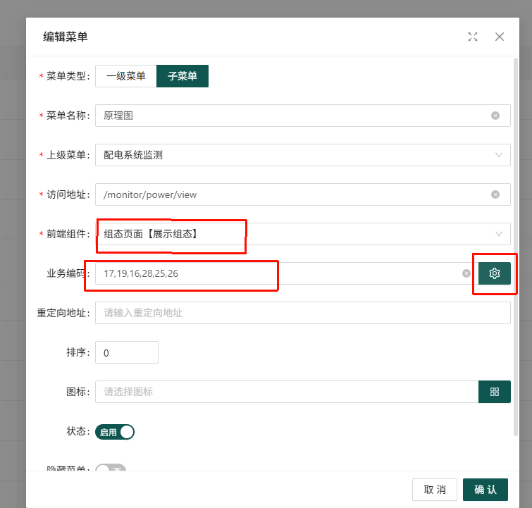

# 组态菜单

## 1. 组态菜单配置概述

用于配置访问组态页面的入口，通过配置菜单可以方便地访问和分组管理各种组态页面到菜单中。比如可以将所有电力系统图放到一个菜单中，命名为“电力系统原理图”，所有暖通相关的图放到一个菜单中，命名为“暖通系统原理图”。

## 2. 新增组态菜单

1. 访问菜单配置页面：http://xxxx/system/menu 以具体系统为准
2. 点击"新增菜单"按钮
3. 设置菜单类型为"子菜单"
4. 输入菜单名称，如"电力系统原理图"
5. **前端组件**选择"组态页面【展示组态】"
6. **业务编码**选择对应的组态数据 ID（保存的组态的数据 id）
7. 设置排序、图标等其他属性
8. 点击"确认"按钮保存菜单

## 3. 业务编码获取

业务编码是保存的组态的数据 ID，获取方法如下：

1. 访问菜单配置页面
2. 新增或编辑菜单
3. 选择前端组件为"组态页面【展示组态】"
4. 业务编码下拉框中会显示所有可用的组态数据 ID，选择对应的 ID 即可

## 4. 组态页面展示

### 4.1 组态页面地址

组态页面的展示页面地址为：http://xxxx/monitor/power/view 以具体系统为准

### 4.2 组态页面布局

- **左侧**：组态名称列表，展示所有可用的组态名称，默认展开可收拢
- **中间**：组态预览区域，默认展示第一个组态图的预览，支持鼠标滚动缩放操作，移动。

### 4.3 组态页面功能

- 左侧展示菜单中该页面下配置的组态数据列表
- 点击左侧组态名称，中间实时展示组态预览
- 支持组态页面的切换和预览
- 支持自适应窗口大小，缩放操作。

## 5. 常见问题

### 5.1 如何配置组态页面菜单？

- 前端组件选择"组态页面【展示组态】"
- 业务编码选择对应的组态数据 ID
